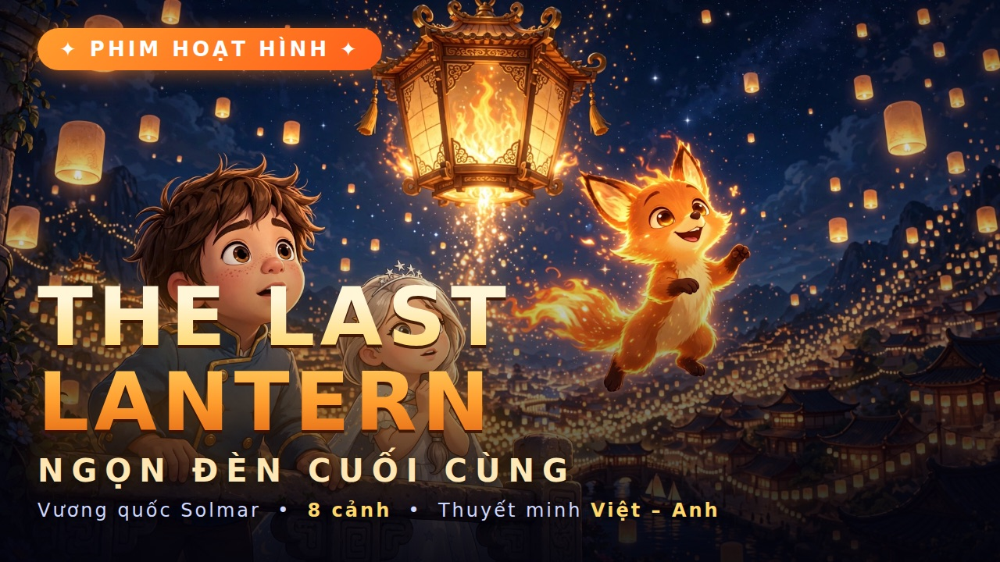
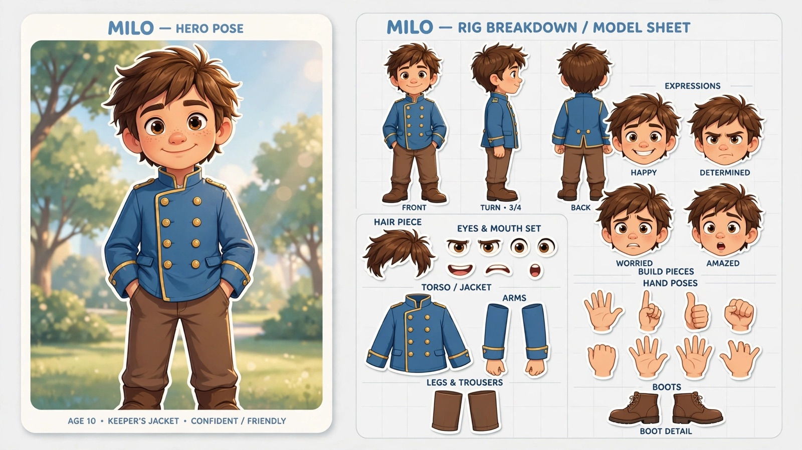
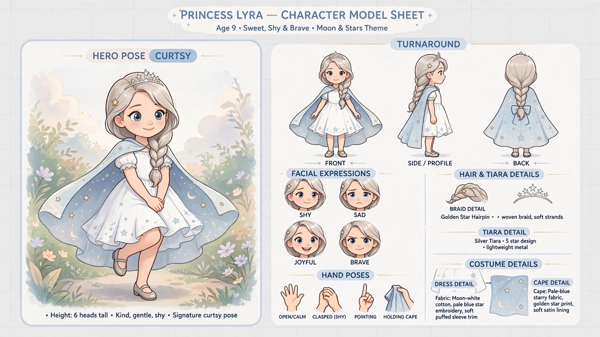
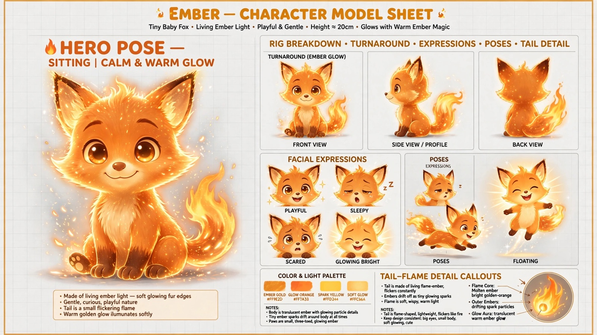
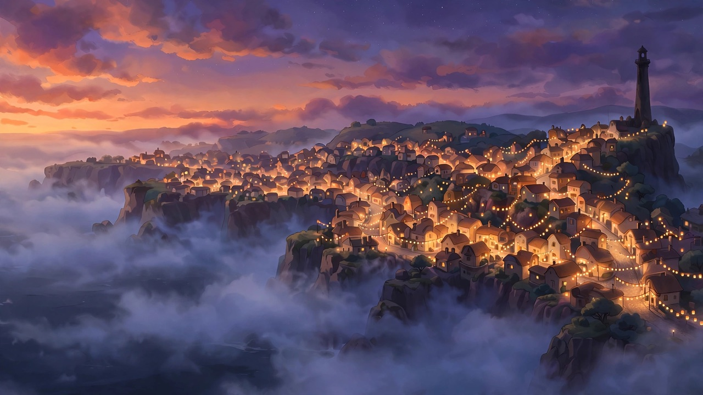
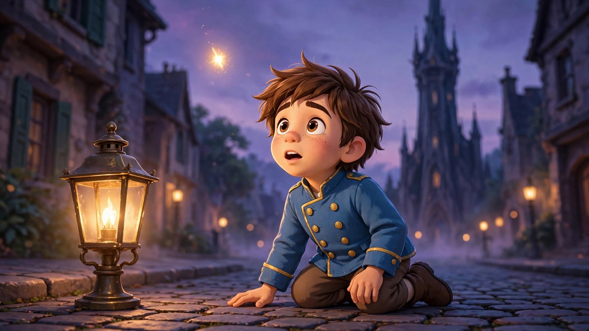
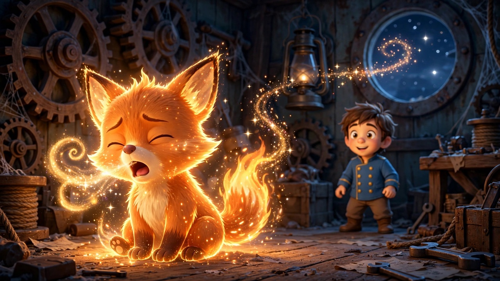
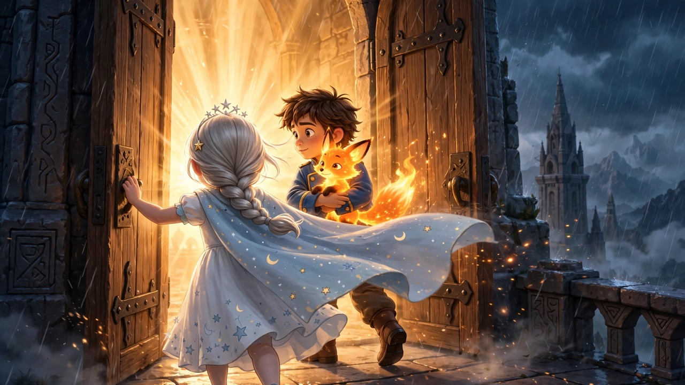
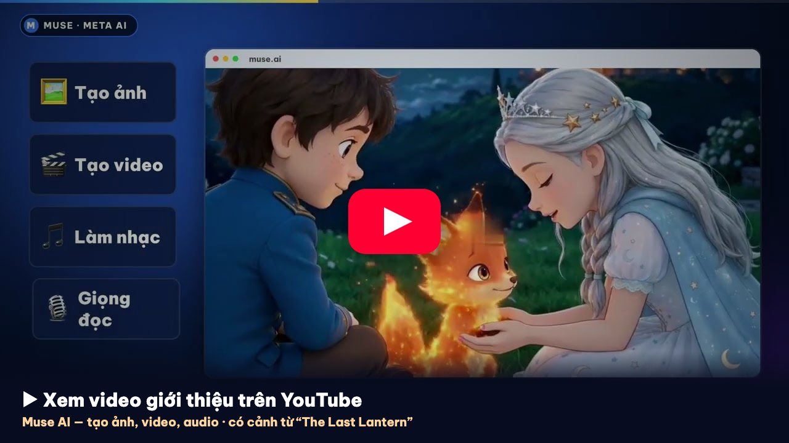

# 🏮 Tác phẩm mẫu: "The Last Lantern" · Ngọn Đèn Cuối Cùng

Phim hoạt hình ngắn **8 cảnh, ~85–90 giây, 16:9**, phong cách 2D Disney/Pixar, thuyết minh Việt – Anh — làm từ đầu đến cuối trên Muse AI bằng skill này. Đây là dự án đã dùng để kiểm chứng pipeline.

> Cậu bé thắp đèn Milo, công chúa Lyra và chú cáo lửa Ember vượt cơn bão để thắp lại Đèn Hoàng Gia của vương quốc Solmar.

## Bộ file của dự án

| File | Giai đoạn | Nội dung |
|---|---|---|
| [`STORY.md`](STORY.md) | 2 · Story bible | Logline, thế giới, character lock, style lock, 8 nhịp cảnh, mô-típ nhạc |
| [`MEGA_PROMPTS.md`](MEGA_PROMPTS.md) | 4 · Mega prompts | 8 prompt copy-paste, thứ tự nạp ref, ghi chú dựng |
| [`VO_SCRIPT.md`](VO_SCRIPT.md) | 6 · Thuyết minh | 8 câu kể chuyện, bản Anh + Việt, mốc thời gian |
| [`FLOW.md`](FLOW.md) | 0 → 7 | Dự án đi qua từng giai đoạn: việc làm, file ra, điểm chốt |

## Nhân vật (Giai đoạn 1)

| Milo | Lyra | Ember |
|---|---|---|
|  |  |  |
| Cậu bé 10 tuổi, áo khoác người giữ đèn | Công chúa 9 tuổi, áo choàng sao | Cáo con làm từ ánh lửa |

## Keyframes (Giai đoạn 3)

| K1 · Cảnh 1 bắt đầu | K2 · Cảnh 1 → 2 |
|---|---|
|  |  |
| **K3 · Cảnh 2 → 3** | **K7 · Cảnh 6 → 7** |
|  |  |

Mỗi keyframe vừa là khung cuối của cảnh trước, vừa là khung đầu của cảnh sau — xem [`FLOW.md`](FLOW.md).

## Xem trong video

Video giới thiệu Muse AI (tạo ảnh, video, audio) — có cảnh từ "The Last Lantern".
